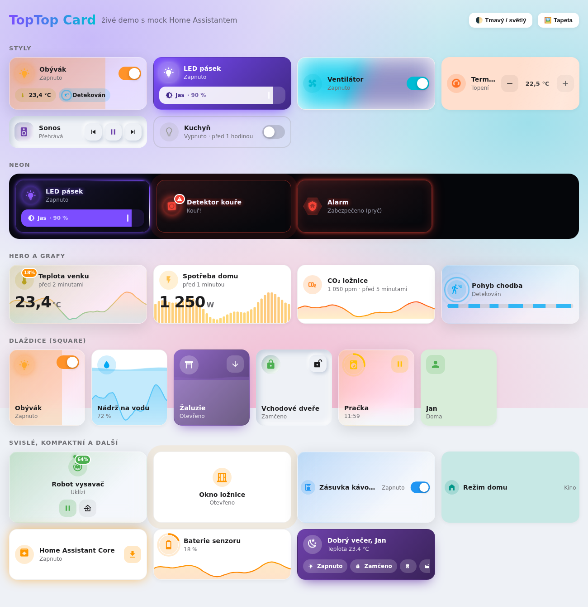
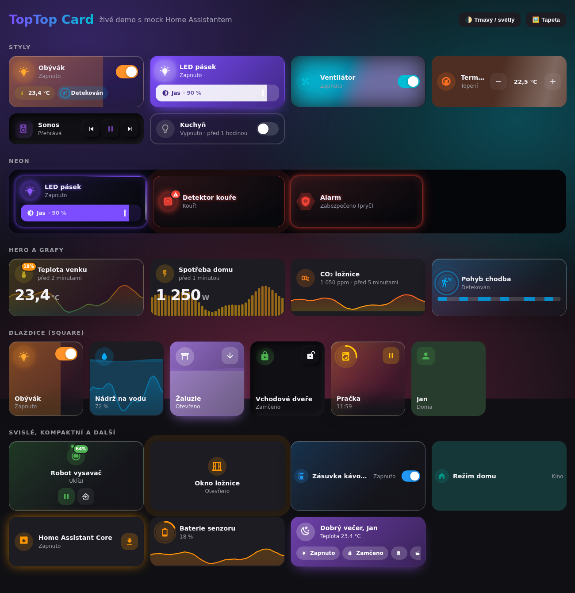
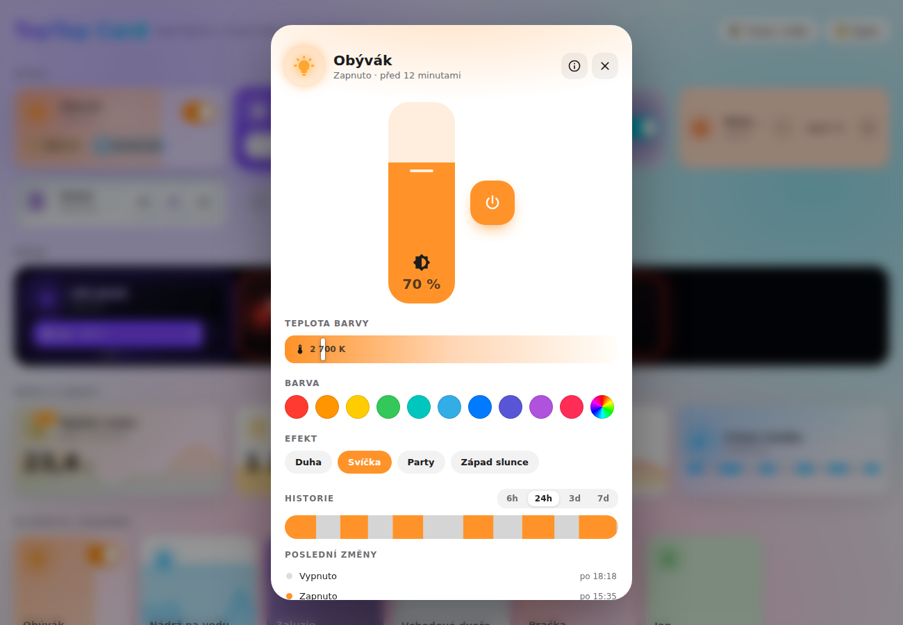
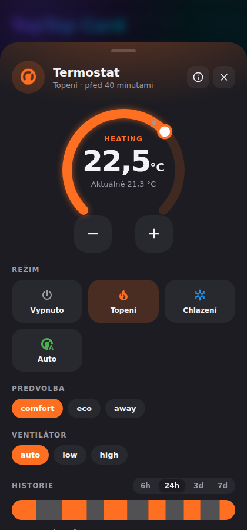

# TopTop Card

**Animovaná dlaždicová karta nové generace pro Home Assistant.** Inspirovaná [Mushroom](https://github.com/piitaya/lovelace-mushroom), ale není to kopie. Přidává věci, které Mushroom nemá: vlastní vyskakovací okna, grafy historie přímo v kartě, 20+ animací ikon, skleněné, neonové a aurora styly, ovládání tažením po celé kartě, čipy, odznaky, prahové barvy a Jinja šablony. Vše nastavíte **klikáním ve vizuálním editoru** i **v YAML**.



| Tmavý režim | Vyskakovací okno – světlo | Vyskakovací okno – termostat (mobil) |
| --- | --- | --- |
|  |  |  |

> 🧪 **Živé demo bez Home Assistantu:** otevřete `demo/index.html` v prohlížeči. Mock HA simuluje entity, služby i historii.

---

## ✨ Co karta umí (a Mushroom ne)

| Funkce | Popis |
| --- | --- |
| 🪟 **Vlastní popup** | Na mobilu se vysune zespodu (dá se zavřít tažením dolů), na počítači je to dialog. Obsahuje velké ovládání podle typu entity: svislý posuvník jasu, teplotu barvy, barvy a efekty světla, kruhový ovladač termostatu, režimy HVAC, přehrávač s obalem alba, klávesnici alarmu, ovládání vysavače, žaluzií, ventilátoru… |
| 📈 **Grafy historie** | Křivka, sloupce nebo časová osa stavů, dole pod obsahem nebo na pozadí karty. Křivka se zbarví podle prahů nebo teploty. V popupu jsou přepínače 6h/24h/3d/7d a statistika min/průměr/max. |
| 🎞️ **22 animací ikon** | `spin` (rychlost se řídí rychlostí ventilátoru), `glow`, `flicker` (oheň při topení), `ping` (radar při pohybu), `orbit` (vysavač), `wiggle` (otevřené okno), `shake` (kouř/voda), `heartbeat`, `rise/sink` (žaluzie), `rainbow`, `jello`… Režim **auto** vybere animaci sám podle entity a stavu. |
| 🎨 **9 stylů karty** | `glass` (glassmorphism), `neon`, `gradient`, `aurora` (animovaná polární záře), `soft` (neumorfismus), `frosted`, `outline`, `minimal`, `default`. |
| ✨ **Efekty karty** | `pulse`, `glow`, `border` (rotující světelný okraj), `shimmer`, `shake`, `breathe`. Fungují i automaticky, třeba při alarmu nebo kouři. |
| 👆 **Tažení po celé kartě** | `slider: card` mění jas, pozici, rychlost nebo hlasitost tažením kdekoliv po kartě (jako v iOS) a ukazuje bublinu s hodnotou. Alternativa je lišta `slider: bar`. |
| 💧 **Výplň podle hodnoty** | Vodorovná výplň nebo **animovaná kapalina s vlnami** (`fill: liquid`), hodí se pro nádrže, baterie a žaluzie. |
| ⭕ **Prstenec průběhu** | Kolem ikony, třeba odpočet časovače nebo stav baterie. |
| 🔢 **Odznak** | Malý štítek v rohu ikony s hodnotou jiné entity, ikonou nebo šablonou. Automaticky upozorní na nedostupnou entitu. |
| 💊 **Čipy** | Další entity přímo v kartě, každá s vlastními akcemi. Podržením otevřete její popup. |
| 🌡️ **Prahy a styly podle stavu** | Barva, ikona, animace a efekt podle číselné hodnoty, s plynulým barevným přechodem. Předvolby pro teplotu, vlhkost, baterii, CO₂, PM2.5 a AQI. |
| 🧩 **Šablony** | Rychlé lokální `{{ state }}`, `{{ attr.brightness }}`, `{{ relative }}`… nebo plná **Jinja** vykreslovaná serverem HA (`{{ states('sensor.x') }}`) v živém odběru. |
| 🧱 **Vložené karty v popupu** | Do popupu můžete vložit libovolné jiné karty Lovelace. |
| 🧊 **3D náklon + odlesk** | Při najetí myší (`tilt: true`), vlnka při kliknutí, haptická odezva na mobilu. |
| ⌨️ **Přístupnost** | Ovládání klávesnicí (Tab/Enter), ARIA role, respektuje `prefers-reduced-motion`. |
| 📐 **Sections ready** | Podporuje `getGridOptions` pro nové rozložení Sections i klasický masonry. |
| 🌍 **Čeština i angličtina** | Popup i editor se přepnou podle jazyka HA. |

---

## 📦 Instalace

### HACS (doporučeno)
1. HACS → ⋮ → **Vlastní repozitáře** → URL tohoto repozitáře, kategorie **Dashboard**.
2. Vyhledejte **TopTop Card** → Stáhnout.
3. Obnovte prohlížeč (Ctrl+F5).

### Ručně
1. Zkopírujte `dist/toptop-card.js` do `config/www/toptop-card.js`.
2. *Nastavení → Řídicí panely → ⋮ → Zdroje → Přidat zdroj*: URL `/local/toptop-card.js`, typ **JavaScript modul**.

Karta je jeden soubor bez závislostí a bez načítání čehokoliv z internetu.

---

## 🚀 Rychlý start

```yaml
type: custom:toptop-card
entity: light.obyvak
style: glass
slider: card        # táhněte po kartě = jas
controls: true      # přepínač přímo na kartě
tilt: true
chips:
  - sensor.teplota_obyvak
  - entity: binary_sensor.pohyb_obyvak
```

Klepnutím otevřete popup, podržením more-info a klepnutím na ikonu přepnete stav.

---

## ⚙️ Všechny volby

### Základ
| Volba | Hodnoty | Výchozí | Popis |
| --- | --- | --- | --- |
| `entity` | entity_id | – | Hlavní entita (volitelné, bez ní funguje jako „template“ karta) |
| `name` | text / `{{ }}` | friendly_name | Název (podporuje lokální šablony) |
| `icon` | `mdi:…` | podle stavu | Ikona |
| `layout` | `horizontal`, `vertical`, `compact`, `hero`, `square` | `horizontal` | Rozložení. `hero` = velká hodnota s grafem, `square` = dlaždice ve stylu Apple Home |
| `style` | `default`, `glass`, `neon`, `gradient`, `aurora`, `soft`, `frosted`, `outline`, `minimal` | `default` | Styl karty |
| `size` | `s`, `m`, `l`, `xl` | `m` | Velikost |
| `icon_shape` | `circle`, `squircle`, `square`, `hexagon`, `blob`, `none` | `circle` | Tvar pozadí ikony (`blob` se při zapnutí „vlní“) |
| `color` | `auto`, název (`red`, `amber`, `deep-purple`…), `#hex`, `rgb()` | `auto` | Barva v aktivním stavu. `auto` použije barvu světla, teplotní gradient, typ senzoru… |
| `color_off` | barva | šedá | Barva ve vypnutém stavu |
| `icon_animation` | `auto`, `none`, `spin`, `pulse`, `breathe`, `bounce`, `shake`, `wiggle`, `swing`, `glow`, `flicker`, `heartbeat`, `float`, `rise`, `sink`, `blink`, `tada`, `flip`, `jello`, `rainbow`, `ping`, `orbit` | `auto` | Animace ikony (běží jen v aktivním stavu) |
| `spin_speed` | např. `2s` | auto | Rychlost rotace pro `spin` |
| `card_effect` | `auto`, `none`, `pulse`, `glow`, `border`, `shimmer`, `shake`, `breathe` | `auto` | Efekt celé karty |
| `background_image` | URL nebo `entity_picture` | – | Obrázek na pozadí (text se přepne na bílý) |
| `tilt` / `tilt_strength` | bool / číslo | `false` / `8` | 3D náklon při najetí myší |
| `ripple` | bool | `true` | Vlnka po kliknutí |
| `haptic` | bool | `true` | Vibrace / haptika v aplikaci HA |

### Obsah
| Volba | Popis |
| --- | --- |
| `show_name`, `show_state`, `show_icon` | Zobrazení částí karty |
| `show_entity_picture` | Místo ikony obrázek entity (osoba, přehrávač…) |
| `secondary_info` | `state`, `last-changed`, `last-updated`, `state-last-changed`, `none`, nebo `attr:<atribut>` |
| `secondary_attribute` | Připojí hodnotu atributu za stav |
| `primary`, `secondary`, `tertiary` | Šablony pro 1., 2. a 3. řádek |

### Ovládání, výplň a graf
| Volba | Hodnoty | Popis |
| --- | --- | --- |
| `slider` | `none`, `bar`, `card`, `auto` | Posuvník (jas, pozice, rychlost, hlasitost, cílová teplota, input_number…) |
| `controls` | bool | Tlačítka na kartě: přepínač, ▲■▼ pro žaluzie, ⏮⏯⏭ pro přehrávač, −/+ pro termostat, zámek, vysavač, časovač, tlačítka a scény |
| `fill` | `auto`, `none`, `horizontal`, `liquid` | Výplň pozadí podle hodnoty |
| `ring` | `auto`, `true`, `false` | Prstenec průběhu kolem ikony |
| `progress_attribute`, `min`, `max` | – | Vlastní zdroj a rozsah průběhu |
| `graph` | `auto`, `none`, `line`, `bar`, `timeline` | Graf historie (`auto` = křivka u číselných senzorů) |
| `graph_position` | `auto`, `bottom`, `background` | Umístění grafu |
| `graph_hours` | číslo | Rozsah grafu v hodinách (výchozí 24) |
| `graph_entity` | entity_id | Graf jiné entity než hlavní |
| `graph_points` | číslo | Počet bodů křivky (výchozí 40) |

### Odznak
| Volba | Popis |
| --- | --- |
| `badge_entity` | Entita, jejíž hodnota se zobrazí v odznaku (např. baterie) |
| `badge_icon`, `badge_text`, `badge_color` | Vlastní ikona, text (šablona) a barva |
| `badge: false` | Vypne odznak, včetně automatického varování „nedostupné“ |

### Čipy
```yaml
chips:
  - sensor.teplota                      # krátký zápis
  - entity: light.lampa
    name: Lampa
    tap_action: { action: toggle }      # výchozí: toggle u přepínatelných, jinak more-info
    hold_action: { action: toptop-popup }  # výchozí: popup této entity
  - icon: mdi:movie-open                # čip bez entity = tlačítko
    name: Kino
    content: "{{ states('sensor.film') }}"   # Jinja šablona
    tap_action:
      action: perform-action
      perform_action: scene.turn_on
      target: { entity_id: scene.kino }
```

### Prahy a styly podle stavu
```yaml
thresholds:                 # pro číselné stavy
  - value: 0
    color: blue
  - value: 21
    color: green
  - value: 26
    color: red
    icon_animation: pulse
    card_effect: glow
threshold_interpolate: true # plynulý přechod barev (výchozí)

state_styles:               # pro konkrétní stavy
  on:  { color: amber, icon_animation: glow }
  off: { icon: mdi:lightbulb-off-outline }
  unavailable: { color: red, card_effect: shake }
```

### Akce
Platí standardní akce HA (`toggle`, `more-info`, `navigate`, `url`, `perform-action`, `assist`, `none`, včetně `confirmation`) a navíc:

| Akce | Popis |
| --- | --- |
| `action: toptop-popup` | Otevře vyskakovací okno TopTop |

| Volba | Výchozí |
| --- | --- |
| `tap_action` | `toptop-popup` |
| `hold_action` | `more-info` |
| `double_tap_action` | – |
| `icon_tap_action` | `toggle` (světla, vypínače, ventilátory, žaluzie, zámky…), jinak stejně jako `tap_action` |

### Vyskakovací okno
| Volba | Výchozí | Popis |
| --- | --- | --- |
| `popup_title` | název | Titulek |
| `popup_controls` | `true` | Velké ovládání podle domény |
| `popup_history` | `true` | Graf historie se statistikou / časová osa s posledními změnami |
| `popup_graph_hours` | `24` | Výchozí rozsah (6/24/72/168) |
| `popup_attributes` | `true` | Rozbalovací seznam atributů |
| `popup_buttons` | – | Mřížka tlačítek (entity nebo akce) |
| `popup_buttons_title` | „Akce“ | Nadpis mřížky |
| `popup_cards` | – | Libovolné karty Lovelace vložené do popupu |
| `popup_styles` | – | Vlastní CSS pro popup |

```yaml
popup_buttons:
  - entity: light.lampa
  - entity: scene.vecer
  - name: Vše vypnout
    icon: mdi:power
    color: red
    tap_action:
      action: perform-action
      perform_action: light.turn_off
      target: { entity_id: all }
popup_cards:
  - type: entities
    entities: [sensor.spotreba, sensor.napeti]
```

### Šablony
**Lokální** (okamžité, bez serveru): `{{ state }}`, `{{ value }}` (formátovaný stav s jednotkou), `{{ name }}`, `{{ unit }}`, `{{ entity_id }}`, `{{ attr.<název> }}`, `{{ relative }}` (před 5 minutami), `{{ last_updated }}`, `{{ user }}`.

**Jinja** (pozná se podle `(`, `|` nebo ``) se vykresluje serverem HA a živě aktualizuje. K dispozici je proměnná `entity`:
```yaml
secondary: "{{ states(entity) | float(0) | round(1) }} °C · {{ state_attr(entity, 'hvac_action') }}"
```

### Pokročilé
`styles`: vlastní CSS vložené do karty (shadow DOM):
```yaml
styles: |
  ha-card { --tt-radius: 28px; }
  .primary { font-family: 'Inter'; letter-spacing: .5px; }
```
Dostupné CSS proměnné: `--tt-color` (barva zapnutého stavu), `--tt-c` (aktuální barva), `--tt-icon`, `--tt-pad`, `--tt-gap`, `--tt-fs1`, `--tt-fs2`, `--tt-big`, `--tt-off`, `--tt-text`, `--tt-text2`.

---

## 🖼️ Recepty

**Teplota s grafem na pozadí a baterií v odznaku**
```yaml
type: custom:toptop-card
entity: sensor.venkovni_teplota
layout: hero
style: glass
badge_entity: sensor.venkovni_teplota_baterie
```

**Nádrž jako kapalina**
```yaml
type: custom:toptop-card
entity: sensor.nadrz_procenta
layout: square
fill: liquid
color: light-blue
```

**Neonová LED s rotujícím okrajem**
```yaml
type: custom:toptop-card
entity: light.led_pasek
style: neon
slider: bar
card_effect: border
```

**Uvítací karta s čipy a rychlými akcemi**
```yaml
type: custom:toptop-card
name: "Dobrý večer, {{ user }}"
icon: mdi:weather-night
color: deep-purple
style: gradient
icon_animation: float
secondary: "Venku {{ states('sensor.teplota') }} °C"
chips: [light.obyvak, lock.dvere, alarm_control_panel.dum]
popup_title: Rychlé akce
popup_buttons:
  - entity: scene.vecer
  - entity: scene.kino
  - entity: switch.kavovar
```

**Detektor kouře, který se nedá přehlédnout** (automaticky: červená, třesoucí se ikona, pulzující karta)
```yaml
type: custom:toptop-card
entity: binary_sensor.kour
style: neon
```

---

## 🛠️ Vývoj

```
src/01-core.js     utility, barvy, logika stavů, grafy, DOM patcher
src/02-styles.js   CSS (animace, styly, popup)
src/03-card.js     základní třída + karta
src/04-popup.js    vyskakovací okno
src/05-editor.js   vizuální editor + registrace
```
`npm run build` spojí zdrojáky do `dist/toptop-card.js`. Bez závislostí, bez bundleru.
Demo: `demo/index.html` (mock HA, otevřete přímo v prohlížeči).

---

## 🇬🇧 English (short)

TopTop Card is a dependency‑free Home Assistant tile card with a built‑in popup (bottom sheet / dialog with domain‑specific big controls), inline history graphs (line/bar/timeline), 22 icon animations with smart `auto` mode, 9 card styles (glass, neon, gradient, aurora, neumorphism…), card effects, drag‑anywhere slider, liquid fill, progress ring, badges, chips, thresholds with color interpolation, local + Jinja templates, embedded cards in popup, 3D tilt, haptics, keyboard support and a full visual editor. Install via HACS (custom repository, type *Dashboard*) or copy `dist/toptop-card.js` to `/config/www`. See the option tables above, since option names are in English.

MIT License
